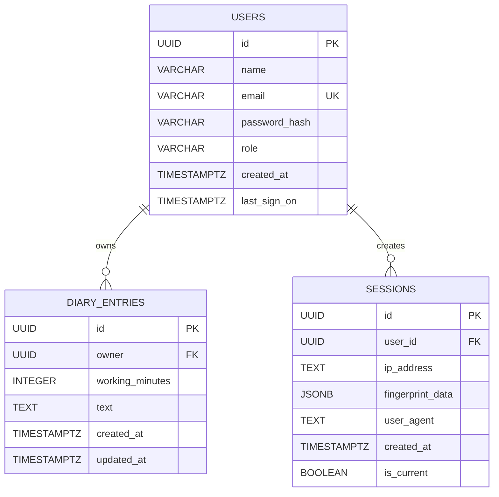

# Database

This document describes the **database layer** used by the backend: how the service connects to PostgreSQL, what schema it manages through migrations, and what the important PostgreSQL data types, constraints, and indexes mean in practice.

## Quick reference

| Topic | Value |
| ----- | ----- |
| Primary database | PostgreSQL |
| Rust access layer | `sqlx` + `PgPool` |
| Connection source | `DATABASE_URL` environment variable |
| Pool size | `10` connections in the app, `5` in integration tests |
| Migration source | `./migrations` |
| Main tables | `users`, `diary_entries`, `sessions` |
| Secondary data store | Redis (`REDIS_URL`) for cache/session-adjacent runtime data, **not** relational records |

## Connection model

The backend connects to PostgreSQL through a single shared SQLx connection pool.

### Runtime flow

1. `Config::from_env()` reads `DATABASE_URL` from the environment.
2. `create_pool()` builds a PostgreSQL connection pool with `PgPoolOptions`.
3. The server starts only after the pool has connected successfully.
4. After connecting, the backend runs every migration in `./migrations` before serving requests.

### Application connection details

- The database URL is **required**.
- The app creates a pool with a maximum of **10 concurrent database connections**.
- Migrations are applied automatically on startup.
- If connection or migration setup fails, the service exits instead of running with a partial schema.

### Local Docker setup

In Docker Compose, PostgreSQL is started as its own service and the backend receives this connection string shape:

```text
postgresql://<user>:<password>@127.0.0.1:5432/<database>
```

Default local values in `docker-compose.yml` are:

- Host: `127.0.0.1`
- Port: `5432`
- User: `teletable`
- Database: `teletable_db`

### Test setup

Integration tests connect using:

- `TEST_DATABASE_URL`, or
- `DATABASE_URL` as a fallback.

The test helper uses a smaller pool size of **5** connections and also runs migrations before tests execute.


## Schema overview

The relational schema currently has three core tables:

- `users` stores account identity, credentials, role, and sign-on timestamps.
- `diary_entries` stores work-log entries owned by a user.
- `sessions` stores login session history and client metadata for a user.

## ER model




## Table reference

### `users`

Stores application users and their authentication metadata.

| Column | Type | Null | Default | Purpose |
| ------ | ---- | ---- | ------- | ------- |
| `id` | `UUID` | No | None | Primary key for the user |
| `name` | `VARCHAR(255)` | No | None | Display name |
| `email` | `VARCHAR(255)` | No | None | Unique login identifier |
| `password_hash` | `VARCHAR(255)` | No | None | Bcrypt-hashed password |
| `role` | `VARCHAR(50)` | No | `'Viewer'` | Authorization role |
| `created_at` | `TIMESTAMP WITH TIME ZONE` | Yes at insert time | `NOW()` | Account creation timestamp |
| `last_sign_on` | `TIMESTAMP WITH TIME ZONE` | Yes | None | Most recent successful sign-in time |

#### Behavior notes

- `email` is unique, so duplicate registrations are rejected at both application and database level.
- `role` originally defaulted to `'user'`, but a later migration changed the default to `'Viewer'` and migrated existing `'user'` rows.
- The role domain is enforced by application logic (`Admin`, `Operator`, `Viewer`). A database `CHECK` constraint was considered in a migration comment but is **not currently enabled**.
- `last_sign_on` is set during registration and updated again on successful login.

#### Indexes

- `idx_users_email` on `email`

This supports fast login and duplicate-email checks.

### `diary_entries`

Stores time-tracked diary/work-log entries.

| Column | Type | Null | Default | Purpose |
| ------ | ---- | ---- | ------- | ------- |
| `id` | `UUID` | No | None | Primary key for the entry |
| `owner` | `UUID` | No | None | References `users.id` |
| `working_minutes` | `INTEGER` | No | None | Minutes worked for the entry |
| `text` | `TEXT` | No | None | Free-form diary content |
| `created_at` | `TIMESTAMP WITH TIME ZONE` | Yes at insert time | `NOW()` | Creation timestamp |
| `updated_at` | `TIMESTAMP WITH TIME ZONE` | Yes at insert time | `NOW()` | Last update timestamp |

#### Behavior notes

- `owner` is a foreign key to `users(id)`.
- The relation uses `ON DELETE CASCADE`, so deleting a user automatically deletes all of that user's diary entries.
- The backend uses ownership checks in queries, so users can only update or delete their own entries.

#### Indexes

- `idx_diary_entries_owner` on `owner`
- `idx_diary_entries_created_at` on `created_at`

These support fast owner-based lookups and reverse-chronological listing.

### `sessions`

Stores login session history and device/client metadata.

| Column | Type | Null | Default | Purpose |
| ------ | ---- | ---- | ------- | ------- |
| `id` | `UUID` | No | None | Primary key for the session row |
| `user_id` | `UUID` | No | None | References `users.id` |
| `ip_address` | `TEXT` | No | None | Captured client IP |
| `fingerprint_data` | `JSONB` | No | `'{}'::jsonb` | Structured client/device fingerprint payload |
| `user_agent` | `TEXT` | Yes | None | Raw HTTP user agent string |
| `created_at` | `TIMESTAMP WITH TIME ZONE` | No | `NOW()` | Session creation timestamp |
| `is_current` | `BOOLEAN` | No | `TRUE` | Whether the row represents the user's current session |

#### Behavior notes

- `user_id` is a foreign key to `users(id)`.
- The relation uses `ON DELETE CASCADE`, so deleting a user also deletes that user's session history.
- On login, the backend marks previous sessions for the user as `is_current = FALSE` and inserts a new current session row.
- On registration, the backend inserts an initial session row immediately.

#### Indexes

- `idx_sessions_user_id` on `user_id`
- `idx_sessions_created_at` on `created_at DESC`
- `idx_sessions_user_id_created_at` on `(user_id, created_at DESC)`
- `idx_sessions_current` on `(user_id, is_current)`

These support user session history queries, recent-session ordering, and fast lookup of the current session state.


## Special data types

### `UUID`

`UUID` is used as the primary key type for all core tables.

- It gives globally unique identifiers without relying on sequential integers.
- It is a good fit for distributed systems and API-facing identifiers.
- In this backend, IDs are typically generated in Rust with `Uuid::new_v4()`.
- One migration also uses PostgreSQL-side `gen_random_uuid()` when seeding the admin user.

### `TIMESTAMP WITH TIME ZONE`

PostgreSQL stores these values as timezone-aware timestamps, often referred to as `timestamptz`.

- Used for `created_at`, `updated_at`, and `last_sign_on`.
- `NOW()` sets the value at insert/update time in the database.
- In Rust, these fields map to `chrono::DateTime<Utc>`.
- This avoids ambiguity compared with local-time timestamps.

### `JSONB`

`JSONB` stores structured JSON in a binary PostgreSQL format.

- Used by `sessions.fingerprint_data`.
- Lets the backend store variable client/device metadata without creating many nullable columns.
- Supports JSON querying and indexing later if the project ever needs more advanced reporting.
- Defaults to an empty JSON object: `'{}'::jsonb`.
